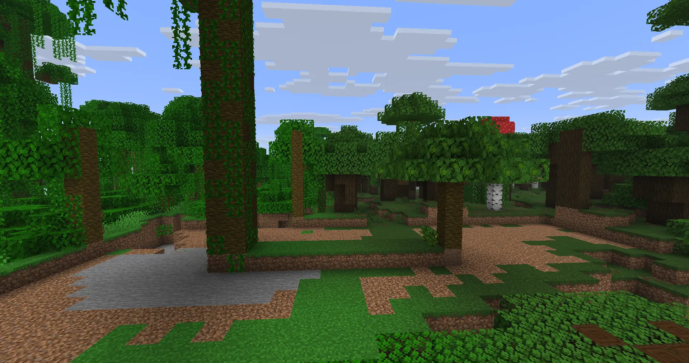

# Stunted Trees

A PaperMC plugin to make tree growth more realistic by changing how trees grow in different biomes.

## Demo
Left tree is in jungle biome right tree is in dark oak wood forest

Some of the stunted tree variants:

## Requirements
The world must have the stunted_trees_datapack in the datapack folders
reload the world after added the datapack

### Config
Uses a config file to specify what biomes work for each tree. Can be found in src/resources/config.yml
Uses datapacks to generate trees with the tree definition provided by mojang. Edit the file in the datapack to get different tree generation.
Loot tables have also been altered with a datapack so if you would like to change what biomes drop what saplings change minecraft/loot_tables/blocks
